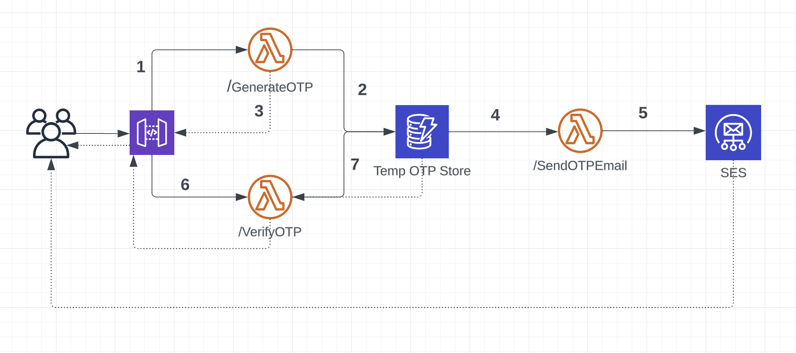

# AWS Infrastructure Documentation

## Table of Contents

- [AWS Infrastructure Documentation](#aws-infrastructure-documentation)
  - [Table of Contents](#table-of-contents)
  - [Introduction](#introduction)
  - [Architecture](#architecture)
  - [Services](#services)
    - [AWS Lambda](#aws-lambda)
      - [GenerateOTP](#generateotp)
      - [SendOTPEmail](#sendotpemail)
      - [VerifyOTP](#verifyotp)
    - [API Gateway](#api-gateway)
    - [DynamoDB](#dynamodb)
      - [EmailVerification Table](#emailverification-table)
    - [Cloudflare Pages](#cloudflare-pages)
    - [SES (Simple Email Service)](#ses-simple-email-service)
    - [CloudWatch](#cloudwatch)
  - [Policies](#policies)
    - [Policy for GenerateOTP Lambda Function - DynamoRW](#policy-for-generateotp-lambda-function---dynamorw)
    - [Policies for VerifyOTP Lambda Function - DynamoRD](#policies-for-verifyotp-lambda-function---dynamord)
    - [Policies for SendOTPEmail Lambda Function - ReadDynamoDBStream \& SendEmail](#policies-for-sendotpemail-lambda-function---readdynamodbstream--sendemail)
  - [Upcoming Features](#upcoming-features)

## Introduction

This documentation serves as a guide for understanding and hosting a simple OTP verification service on AWS.

## Architecture



The architecture diagram above illustrates the components and connections needed to host this service on AWS.

## Services

### AWS Lambda

#### GenerateOTP

- **Trigger**: API Gateway - POST request
- **Functionality**: Stores `email` and `otp` in DynamoDB with a `ttl` attribute set to expire after 5 minutes.

#### SendOTPEmail

- **Trigger**: DynamoDB Stream (Filters for `INSERT` events)
- **Functionality**: Uses SES to send an email when an OTP is generated.

#### VerifyOTP

- **Trigger**: API Gateway - POST request
- **Functionality**: Verifies `otp` against DynamoDB.

### API Gateway

HTTP API Gateway with 2 routes:

- /GenerateOTP (POST - GenerateOTP Lambda Function)
- /VerifyOTP (POST - VerifyOTP Lambda Function)

### DynamoDB

#### EmailVerification Table

- **Primary Key**: `email` (string)
- `otp` (6-digit random string generated)
- `ttl` (time to live - Number)
- Stream enabled
- TTL enabled for `ttl` attribute

### Cloudflare Pages

- Set up for static website hosting.

### SES (Simple Email Service)

- **Important Note**: [Link to SES Note](https://stackoverflow.com/questions/37528301/email-address-is-not-verified-aws-ses)

### CloudWatch

- Logs, Events, Metrics auto-configured for Lambda functions.

## Policies

#### Policy for GenerateOTP Lambda Function - DynamoRW

```json
{
  "Version": "2012-10-17",
  "Statement": [
    {
      "Sid": "DynamoReadWriteAccess",
      "Effect": "Allow",
      "Action": ["dynamodb:PutItem", "dynamodb:GetItem"],
      "Resource": "arn:aws:dynamodb:<region>:<aws-account-id>:table/EmailVerification"
    }
  ]
}
```

#### Policies for VerifyOTP Lambda Function - DynamoRD

```json
{
  "Version": "2012-10-17",
  "Statement": [
    {
      "Sid": "DynamoReadDeleteAccess",
      "Effect": "Allow",
      "Action": ["dynamodb:DeleteItem", "dynamodb:GetItem"],
      "Resource": "arn:aws:dynamodb:<region>:<aws-account-id>:table/EmailVerification"
    }
  ]
}
```

#### Policies for SendOTPEmail Lambda Function - ReadDynamoDBStream & SendEmail

```json
{
  "Version": "2012-10-17",
  "Statement": [
    {
      "Sid": "DynamoDBStreamAccess",
      "Effect": "Allow",
      "Action": [
        "dynamodb:GetShardIterator",
        "dynamodb:DescribeStream",
        "dynamodb:GetRecords",
        "dynamodb:ListStreams"
      ],
      "Resource": "arn:aws:dynamodb:<region>:<aws-account-id>:table/EmailVerification/stream/*"
    },
    {
      "Sid": "DynamoListStreams",
      "Effect": "Allow",
      "Action": "dynamodb:ListStreams",
      "Resource": "*"
    }
  ]
}
```

```json
{
  "Version": "2012-10-17",
  "Statement": [
    {
      "Effect": "Allow",
      "Action": ["ses:SendEmail", "ses:SendRawEmail"],
      "Resource": "*"
    }
  ]
}
```

## Upcoming Features

- [ ] Terraform scripts for infrastructure provisioning
